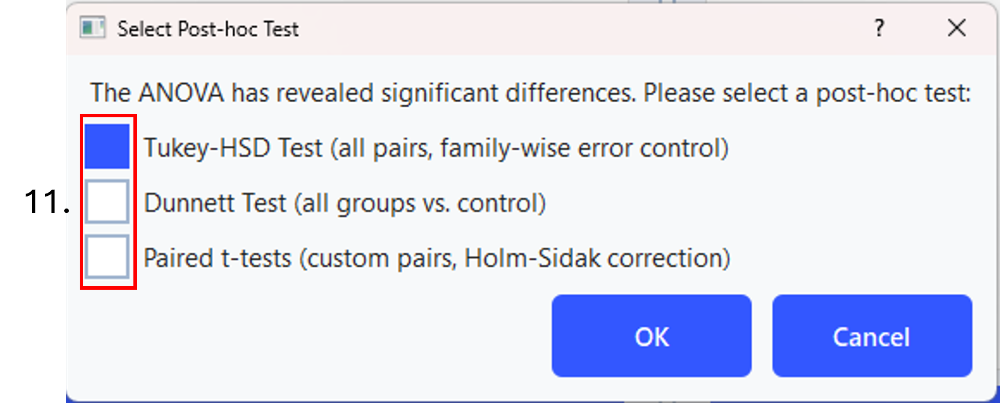
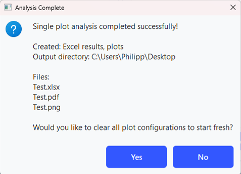

# BioMedStatX User Guide

This guide explains how to use the BioMedStatX application: from launching the program, importing data, running statistical analyses, customizing plots, and exporting results. All information is focused on the user interface, available statistics, and practical workflow — no programming or code knowledge required.

---

## 1. Launching the Application

- Locate the `BioMedStatX.exe` file in your installation directory.
- Double-click to start. A Qt-based GUI window will open.

> Note for source-based usage: launcher scripts are available at the repository root as `Start_BioMedStatX_on_Linux.sh` for Linux/macOS and `start.bat` for Windows. They prefer a native binary if present and otherwise run the Python source `Source_Code/statistical_analyzer.py`.

> Example Excel template: the sample spreadsheet is included in the repository docs as `docs/StatisticalAnalyzer_Excel_Template.xlsx`.

---

## 2. Importing Data

Click **Load Excel / CSV** to select your data file (Excel `.xlsx`/`.xls` or CSV `.csv`).

After loading, select the **Worksheet** from the dropdown. A **Table Preview** shows the first rows of your data so you can verify it loaded correctly.

---

## 3. Smart Mapping — Assigning Columns to Roles

After loading your data, the right panel shows **Smart Mapping**. The app tries to auto-detect the correct mapping, but you can adjust it by dragging header cards from the **Excel Headers** section into the appropriate bucket.

There are six buckets:

| Bucket | What goes here |
|---|---|
| **Dependent Variable** | The column with your measurements (e.g., `Value`, gene expression, weight) |
| **Factor 1** | The main predictor — categorical (e.g., `Group`) → ANOVA/t-Test; continuous (e.g., `Pump time`) → Correlation/Regression |
| **Factor 2** *(optional)* | A second grouping variable for Two-Way or Mixed ANOVA |
| **Subject ID** *(optional)* | Identifies individual subjects for repeated/paired measurements |
| **Covariates** *(optional)* | Continuous confounders to control for (e.g., Age, BMI) → ANCOVA or Multiple Regression |
| **Filter** *(optional)* | Restrict the analysis to a subset of rows (see Section 15) |

### What is the difference between Factor and Subject ID?

This is a common source of confusion:

- **Factor** = a variable that defines *experimental groups* or *conditions* you want to compare. Even if the values look like names (e.g., `WT`, `KO`), they are the *levels* of an independent variable — the thing you are testing. Example: `Group` with levels `WT` and `KO` is Factor 1 because you want to compare these two groups statistically.

- **Subject ID** = a variable that identifies *which individual* produced a measurement. It is only needed when the same individual was measured more than once (repeated measures or paired designs). Example: `Subject` with values `S01`, `S02`, `S03` goes into Subject ID because it links multiple rows that belong to the same mouse.

**Examples by design:**

| Design | Dependent Variable | Factor 1 | Factor 2 | Subject ID |
|---|---|---|---|---|
| T-Test / One-Way ANOVA | Value | Group (WT / KO) | — | — |
| Repeated Measures ANOVA | Value | Timepoint (0h / 2h / 6h) | — | Subject |
| Two-Way ANOVA | Value | Group | Treatment | — |
| Mixed ANOVA | Value | Timepoint | Group | Subject |

The mapping status line below the buckets tells you whether the current mapping is valid and which test will be inferred.

---

## 4. Single vs. Multi-Dataset Analysis

Use the radio buttons above the table preview to switch between modes:

- **Single Analysis**: exactly one measurement column. Use this for a single readout (e.g., one gene, one parameter).
- **Multi-Dataset Analysis**: two or more measurement columns are analysed with the same factor mapping. Use this when you have several genes or parameters in separate columns and want to run the same statistical design on all of them at once. This mode is restricted to ANOVA-capable designs.

---

## 5. Starting the Analysis

Click **Start Auto Analysis**. The app infers the correct statistical test from your mapping and runs the full workflow automatically:

1. Normality and variance checks
2. Test selection (parametric or nonparametric)
3. Main test execution
4. Post-hoc comparisons (if significant)
5. Plot generation
6. Export to Excel

---

## 6. Export Settings

Before or after the analysis, the **Export** section lets you:

- Set the **Output file name** for the results Excel file and plot files.
- Reorder groups in the **Group order** list by dragging — this controls the left-to-right order of groups in the plot.

---

## 7. Assumption Checks & Data Transformations

Before any statistical test, the app automatically checks for normal distribution and equal variances. If your data does not meet the assumptions for a parametric test, you will be prompted to apply a transformation.

**Transformation options:** Log10 (for right-skewed positive data), Box-Cox (automatic lambda optimization), or Arcsin square root (for percentages/proportions). You can skip the transformation if you prefer a nonparametric test.

---

## 8. Post-Hoc Comparisons

If the main test reveals a significant result, the app asks you to choose a post-hoc test.

Available options:
- **Tukey-HSD**: all pairwise comparisons, family-wise error control. Use when you want to compare every group against every other group.
- **Dunnett**: all groups vs. a single control group. Use when you have one reference group (e.g., WT).
- **Paired t-tests (Holm-Sidak)**: custom pairwise comparisons with correction for multiple testing.

Results are shown as significance letters or brackets on the plot and as a table in the exported Excel file.

---

## 9. Plot Customization

After an analysis, the **Plot Appearance Settings** dialog (accessible via the plot preview) lets you adjust:

- Figure size (width, height, DPI)
- Typography (axis labels, title, font size)
- Colors and hatches per group
- Error bar style (SD / SEM, caps)
- Data point style (jitter, strip, swarm)
- Significance annotation style (letters or brackets)
- Legend position and title
- Background and grid style
- Paired lines for repeated-measures plots

---

## 10. Statistical Analyses — Overview

BioMedStatX automatically selects the appropriate test. Supported designs include:

- Two-group comparisons: t-test (independent or paired), Mann-Whitney U
- Multi-group comparisons: One-Way ANOVA, Kruskal-Wallis
- Repeated Measures ANOVA (one within-subject factor)
- Two-Way ANOVA (two between-subject factors)
- Mixed ANOVA (one between-subject factor, one within-subject factor)
- ANCOVA / Two-Way ANCOVA (categorical Factor 1 + continuous Covariates)
- Linear Mixed Model (LMM) — for longitudinal designs with a Subject ID and continuous Factor 1
- Logistic Regression — for binary outcomes (0/1 dependent variable)
- Correlation (Pearson/Spearman) — continuous Factor 1, no Covariates
- Linear Regression (OLS) — continuous Factor 1 + Covariates

Nonparametric fallbacks for Repeated Measures ANOVA (Friedman), Two-Way ANOVA (Freedman-Lane), and Mixed ANOVA (Brunner-Langer ATS) are fully implemented and applied automatically when normality assumptions cannot be met.

---

## 11. Decision Tree Visualization

The statistical decision process is documented as a graphical flowchart. The actual path taken through the decision tree is highlighted. The image is included in the exported Excel workbook.

---

## 12. Exporting Results

After the analysis, all results are exported automatically to a comprehensive Excel file. The exported file contains:

- A summary of all tests and p-values
- Assumption check results
- Main test results and effect sizes
- Descriptive statistics per group
- The decision tree image
- Raw data snapshot
- Pairwise comparison table
- A chronological analysis log

Each sheet is clearly named for easy navigation.

The completion dialog confirms the output directory and lists all created files (Excel, PDF, PNG).

---

## 13. Outlier Detection (Optional)

Under **Analysis → Detect Outliers**, you can identify and flag outliers using:

- Modified Z-Score Test
- Grubbs' Test
- Single-pass or iterative mode

Results are exported to Excel for further review.

---

## 14. Quick Workflow

1. **Launch** the application.
2. **Load** your Excel or CSV file.
3. **Select** the worksheet.
4. **Map** columns in Smart Mapping: Dependent Variable, Factor 1, and optionally Factor 2 and Subject ID.
5. **Choose** Single or Multi-Dataset Analysis.
6. **Set** the output file name and group order in the Export section.
7. **Click** Start Auto Analysis.
8. **Review** transformation and post-hoc prompts if they appear.
9. **Find** your results in the output directory.

---

### Tips & Best Practices

- Group labels (e.g., WT, KO) go into **Factor**, not Subject ID — they define experimental conditions, not individual identities.
- Subject ID is only needed when the same individual appears in multiple rows (repeated/paired measures).
- For paired designs, every subject must have exactly one measurement per condition.
- Use the **Analysis Log** sheet in the exported Excel file for troubleshooting and detailed steps.
- For highly skewed data, apply a Log10 transformation when prompted.

---

## 15. Filter Bucket — Subgroup Analysis

The **Filter** bucket lets you restrict any analysis to a subset of rows before the statistical test runs. This is useful for subgroup analyses (e.g., "only On-Pump patients", "only female subjects").

### How to use

1. Drag any **categorical column** (e.g., `OP-Group`, `Sex`, `Treatment`) into the Filter bucket.
2. A dropdown appears with all unique values in that column (e.g., `1`, `7` or `On-Pump`, `Off-Pump`).
3. Select the value you want to analyse.
4. The bucket shows the filtered row count: *"Analyse auf n=93 Zeilen beschränkt."*
5. Click **Start Auto Analysis** — the entire pipeline (assumption checks, test selection, output) runs only on the filtered subset.

> **Tip:** The ⓘ button on the Filter bucket title explains its purpose at any time.

> **Warning:** If the filter results in fewer than 5 rows, the analysis will abort with a warning.

---

## 16. Correlation Analysis

BioMedStatX automatically selects **Correlation** when:
- Factor 1 contains a **continuous variable** (more than 10 unique numeric values), AND
- No Subject ID is set, AND
- No Covariates are assigned.

### Configuration

| Bucket | What to drop |
|---|---|
| **Dependent Variable** | Outcome variable (e.g., NK cell count) |
| **Factor 1** | Continuous predictor (e.g., miRNA expression) |
| **Filter** *(optional)* | Restrict to a subgroup (e.g., On-Pump only) |

### How the method is chosen

BioMedStatX runs Shapiro-Wilk normality tests on both variables:
- Both normally distributed → **Pearson r**
- At least one non-normal → **Spearman ρ**

### What is reported

| Statistic | Description |
|---|---|
| r / ρ | Correlation coefficient |
| p-value | Two-tailed significance |
| 95% CI | Fisher z-transform confidence interval |
| n | Number of valid pairs (pairwise deletion) |
| Method | Pearson or Spearman |
| Interpretation | Weak / Moderate / Strong, direction |

Results are exported to the **Correlation** sheet in the Excel output.

---

## 17. Linear Regression (OLS)

BioMedStatX automatically selects **Linear Regression** when:
- Factor 1 contains a **continuous variable**, AND
- At least one variable is placed in the **Covariates** bucket.

Without covariates: Simple Regression (1 predictor). With covariates: Multiple Regression.

### Configuration

| Bucket | What to drop |
|---|---|
| **Dependent Variable** | Outcome / dependent variable |
| **Factor 1** | Primary continuous predictor (e.g., Pump time) |
| **Covariates** | Additional predictors to control for (e.g., Age, BMI) |
| **Filter** *(optional)* | Subgroup restriction |

### What is reported

**Model summary:** R², Adjusted R², F-statistic, p(F), AIC, BIC

**Coefficient table:**

| Column | Description |
|---|---|
| Beta | Regression coefficient |
| SE | Standard error |
| t | t-statistic |
| p | p-value (two-tailed) |
| 95% CI | Confidence interval for Beta |

**Residual diagnostics:**

| Test | Checks for |
|---|---|
| Shapiro-Wilk on residuals | Normality of residuals |
| Breusch-Pagan | Homoscedasticity (equal variance) |
| Ramsey RESET | Linearity / model specification |

Results are exported to the **LinearRegression** sheet in the Excel output.

For detailed guidance on interpreting diagnostics, see [CORRELATION_REGRESSION_GUIDE.md](./CORRELATION_REGRESSION_GUIDE.md).

---

## 18. Exploratory Correlation Matrix

The **Explorative Korrelationsmatrix** button (in the Auto-pilot center panel, below Start Analysis) opens a dedicated dialog for exploring pairwise correlations across all numeric variables in your dataset.

### Dialog options

| Option | Description |
|---|---|
| Variable selection | Check/uncheck which numeric columns to include |
| Method | Auto (Shapiro-Wilk per pair), Spearman, or Pearson |
| Missing data | Pairwise deletion (each pair uses its own n) or Listwise (complete cases only) |
| Multiple testing correction | FDR (Benjamini-Hochberg), Bonferroni, or None |
| Stratify by | Optional: run the matrix separately per group (categorical column) |

### Output

Three Excel sheets are generated:

| Sheet | Content |
|---|---|
| Corr_r | Matrix of correlation coefficients |
| Corr_p_corrected | Matrix of corrected p-values |
| Corr_n | Matrix of sample sizes per pair |

The n-matrix is essential when data has missing values — it makes the impact of pairwise deletion transparent.

> **Recommendation:** Use **FDR (Benjamini-Hochberg)** for exploratory analyses to control the false discovery rate while maintaining power. Use **Bonferroni** only when a few pre-specified hypotheses are tested.

---

Happy analyzing!
